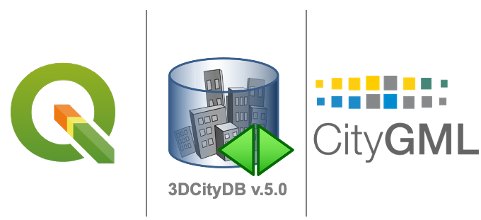
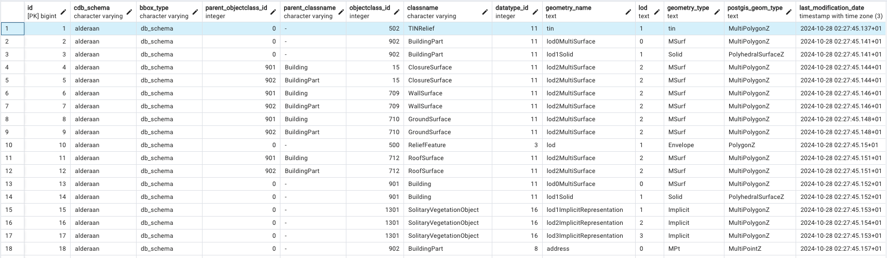
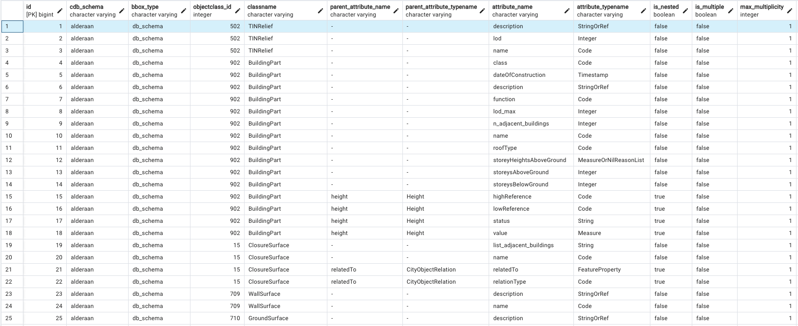
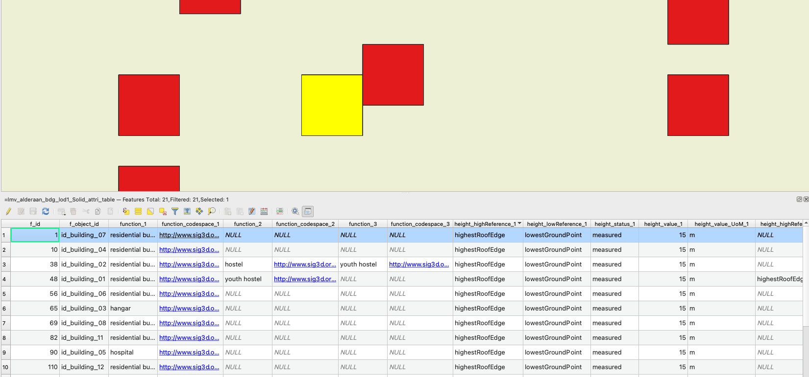
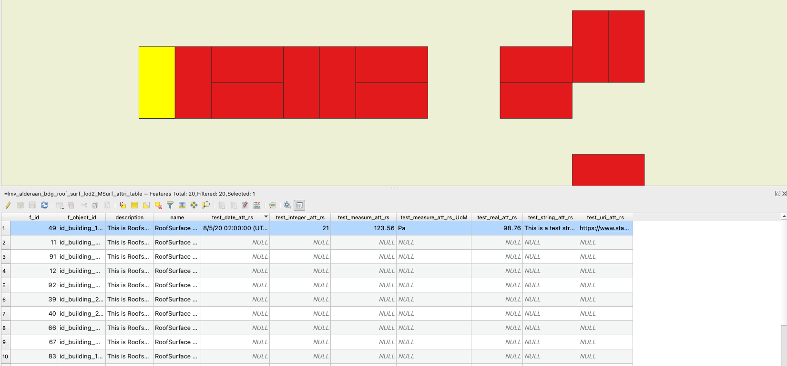
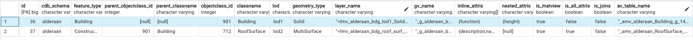

# 3DCityDB-Tools Plug-In for QGIS: Server-Side Support for 3DCityDB v.5.0
This repository contains the work of the master's thesis titled **"3DCityDB-Tools plug-in for QGIS: Adding server-side support to 3DCityDB v.5.0,"** which includes trial updates on the server side of 3DCityDB-Tools-for-QGIS tailored for 3DCityDB v.5.0. The full document is available on the [TU Delft Library](https://repository.tudelft.nl/record/uuid:5992ba24-8618-48d7-9e24-28839b5da16b).

<p align="center">
  
</p>
<!-- <p align="center">
<br>
<kbd>
<a href="docs/images/demo.mp4" target="_blank">
</a>
</kbd>
<br><br>
</p> -->

## Introduction
### GIS Layer-Based Data Interaction with 3DCityDB v.5.0 Using PostgreSQL
  3D city model data often requires relational databases such as [**3D City Database (3DCityDB)**](https://www.3dcitydb.org/3dcitydb/) for efficient access and management due to their large data size.

  [**3DCityDB-Tools for QGIS**](https://plugins.qgis.org/plugins/citydb-tools/) is a plug-in developed by the **3D Geoinformation group at TU Delft**. It provides a user-friendly GUI for creating GIS layers from data encoded within 3DCityDB using PostgreSQL/PostGIS. These GIS layers consist of unique feature geometries associated with attributes and follow the [Simple Feature for SQL (SFS) Model](https://docs.qgis.org/3.34/en/docs/training_manual/spatial_databases/simple_feature_model.html). The layer-based approach offers a more intuitive data interaction, especially for AEC practitioners who often use GIS applications for spatial data analysis.

  The current [**3DCityDB-Tools for QGIS**](https://plugins.qgis.org/plugins/citydb-tools/) only supports 3DCityDB up to version 4.x, which follows CityGML 1.0 & 2.0 standards. As the [CityGML 3.0](https://www.ogc.org/publications/standard/citygml/) was released in 2021, the 3DCityDB is being updated to version 5.0 to add full support for [CityGML 3.0](https://www.ogc.org/publications/standard/citygml/). Consequently, an adaptation of the **3DCityDB-Tools for QGIS** is necessary to address these changes. This repository presents an initial server-side approach to create GIS layers from the 3DCityDB v.5.0 structure.

### Features
  - Interaction with 3D city model data from 3DCityDB for PostgreSQL/PostGIS database in QGIS.
  - Flatten (linearise) complex feature schemas to support data consumption.
  - Enhanced support of the **3DCityDB-Tools for QGIS** following CityGML 3.0 standards.

  The plug-in's development is documented in the [3DCityDB-Tools-for-QGIS repository](https://github.com/tudelft3d/3DCityDB-Tools-for-QGIS) hosted by **3D Geoinformation group at TU Delft**.

## Requirements
  This server-side support of the 3DCityDB-Tools for QGIS has been developed using:
  - **[PostgreSQL](https://www.postgresql.org/) >= 12** (version 16) with **[PostGIS](https://postgis.net/) >= 3.0** (version 3.4.2)
  - **[3DCityDB 5.0 Command line tool](https://github.com/3dcitydb/citydb-tool)** (version 0.8.1-beta)
  - **[QGIS](https://www.qgis.org/download/)** (version 3.34.8-Prizren)

  For managing PostgreSQL, the open-source tool [pgAdmin4](https://www.pgadmin.org/) is in use and is recommended.

## 3DCityDB 5.0 Setup
### Step 1: Install PostgreSQL
  Install PostgreSQL, which can be done using the [EDB installer](https://www.enterprisedb.com/downloads/postgres-postgresql-downloads). Download and unzip the [3DCityDB 5.0 Command line tool](https://github.com/3dcitydb/citydb-tool) package.

### Step 2: Create User and Database in pgAdmin4
  1. **Create new user role and set privileges**

      Create a new user and set privileges for this newly created role by granting full access in the side panel under `Login/Group Roles`.

      <p align="center">
        
      </p>

  2. **Create new database for data import**

      Create a new database under the PostgreSQL server.
      <p align="center">
        
      </p>

  3. **Create necessary extensions**
      Open a new query tool tab and run the following scripts to create the extensions for installing 3DCityDB 5.0 schemas:

      ```pgSQL
      CREATE EXTENSION IF NOT EXISTS postgis SCHEMA public; 
      CREATE EXTENSION IF NOT EXISTS postgis_raster SCHEMA public;
      CREATE EXTENSION IF NOT EXISTS "uuid-ossp" SCHEMA public; 
      CREATE EXTENSION IF NOT EXISTS pldbgapi SCHEMA public;
      ```

### Step 3: Configure Connection Details
  The procedures for setting up new 3DCityDB 5.0 instances are referenced from the [database setup instruction](https://github.com/3dcitydb/3dcitydb?tab=readme-ov-file#database-setup). The following steps demonstrated using MacOS `Terminal`.

  Navigate to the `3dcitydb/postgresql/shell-scripts/unix` directory in the 3DCityDB 5.0 command-line-tool folder and edit the `connection details`:

  ```bash
    export PGBIN  = path_to_psql
    export PGHOST = your_host_address
    export PGPORT = your_port_number
    export CITYDB = your_database
    export PGUSER = your_username
  ```

### Step 4: Create 3DCityDB 5.0 Schemas
  Navigate to the `3dcitydb/postgresql/shell-scripts/unix`, execute the `create_db.sh` shell script by the following command:
  ```bash
  sh create_db.sh
  ```

  The script will prompt for:
  
  (1) Spatial Reference System ID (SRID) to be used for all geometry objects. (e.g. 28992 for the Dutch SRID) <br>
  (2) EPSG code of the height system (optional) (e.g. 5109 for the Dutch height system).<br>
  (3) String encoding of the SRS used for the gml:srsName attribute in CityGML exports.

  After successful execution, two default schemas (citydb and citydb_pkg) will be created under the target database. You can create additional 3DCityDB 5.0 schemas by running the `create_schema` shell script.
  <p align="center"> 
     
  </p>

### Step 5: Import Spatial Data
  To import CityGML/CityJSON data, navigate to the 3DCityDB 5.0 command-line-tool folder and use the following command:
  ```bash
  sh citydb import [citygml/cityjson] [<file>] 
    --db-host localhost 
    --db-port [your_port_number] 
    --db-name [target_database] 
    --db-username [your_user_name] 
    --db-password [your_password] 
    --db-schema [target_schema]
  ```

  The 3DCityDB 5.0 schems that store the imported data are referred to `cdb_schema`.

## Usage
### Step 1: Install QGIS Package
  Download and unzip the package of this repository. Open a new query tool tab in pgAdmin4, and manually execute all SQL script files in order under the `postgresql` folder. After a successful execution, the schema named `qgis_pkg` is installed and contains functions for the operations.

### Step 2: Create `usr_schema`
  Create a new user schema for storing the metadata tables and the generated GIS layers, which can be done by executing the following command:
  ```pgSQL
  SELECT * FROM qgis_pkg.create_qgis_usr_schema('usr_name');
  ```

  The newly created `usr_schema` will be named as `qgis_usr_name`, which contains 4 tables:

  1. **extents**: Stores the bounding box geometries for extent selection.
  2. **feature_geometry_metadata**: Stores the metadata of the existing feature geometries within the `cdb_schema`.
  3. **feature_attribute_metadata**: Stores the metadata of the existing feature attributes within the `cdb_schema`.
  4. **layer_metadata**: Stores the users' choices of the generated GIS layers.

### Step 3: Specify Opertation `Extent`
  It is required for the users to specify the bounding box types (`db_schema` or `m_view`) for further operations. The full `cdb_schema` extent (`db_schema` type) is calculated by defult using the following command:
  ```pgSQL
  SELECT * FROM qgis_pkg.upsert_extents('usr_schema', 'cdb_schema');
  ```

  Users can specify `m_view` type by offering the bounding box geometries. It can be achieved using the `ST_MakeEnvelope` function supported in PostGIS, which takes the 4 vertex coordinates of the extent regarding the local EPSG code as shown in the following command:
  ```pgSQL
  SELECT * FROM qgis_pkg.upsert_extents('usr_schema', 'cdb_schema', 'm_view', ST_MakeEnvelope(232320, 480620, 232615, 481025, 28992));
  ```

  The extent types determine the bounding boxes used for checking existing feature geometries, attributes and creating GIS layers.

### Step 4: Check Existince of Feature `Geometries`
  For checking the existing feature geometries in the `cdb_schema`, users can choose to perform full schema (default) scan using the command:
  ```pgSQL
  SELECT * FROM qgis_pkg.update_feature_geometry_metadata('usr_schema', 'cdb_schema');
  ```
  or only check the geometries within the specified extent by offering the extent type:
  ```pgSQL
  SELECT * FROM qgis_pkg.update_feature_geometry_metadata('usr_schema', 'cdb_schema', 'm_view');
  ```

  The information of the existing feature geometries is stored in the `feature_geometry_metadata` table under the `usr_schema`.
  <p align="center"> 
     
  </p>


### Step 5: Check Existince of Feature `Attributes`
  Similar to checking feature geometries, users can choose to perform full schema (default) scan to check the existing feature attributes in the `cdb_schema` using the command:
  ```pgSQL
  SELECT * FROM qgis_pkg.update_feature_attribute_metadata('usr_schema', 'cdb_schema');
  ```
  or only check the attributes within the specified extent by offering the extent type:
  ```pgSQL
  SELECT * FROM qgis_pkg.update_feature_attribute_metadata('usr_schema', 'cdb_schema', 'm_view');
  ```

  The information of the existing feature attribute is stored in the `feature_attribute_metadata` table under the `qgis_usr_schema`.
  <p align="center"> 
     
  </p>

 ### Step 6: `Create GIS Layers`
  The `feature_geometry_metadata` and `feature_attribute_metadata` tables are used for checking available options for creating GIS layers.

  For `geometries`, users can select:
   - Desired geometry representation
   - Desired LoD

  For `attributes`:
   - Users can select desired attributes to interact with via GIS layers
   - Generic attributes are treated as “standard” attributes
   - Attribute names in other characters (e.g. kanji in Japanese) can be used as column names
  
#### `Create Individual GIS Layer`
  Execute **qgis_pkg.create_layer()** for individual layer creation, which takes the following inputs:
   1. **usr_schema**
   2. **cdb_schema**
   3. **parent_objectclass_id** (only for boundary features, 0 for space feature)
   4. **objectclass_id**
   5. **geomtry_name**
   6. **lod**
   7. **attris** (Default null, specifies selected attribute names in text array)
   8. **is_matview** (Default null, determines layer is stored as view or materialized view)
   9. **is_all_attri** (Default null, determines if all existing attributes of the target class are selected)
   10. **is_joins** (Default null, determines layer is created by joining multiple indivdual attribute views or by joining an integrated attribute table view)

  Following examples shows the commands and results for creating GIS layers in different cases:

  - #### <a name="example_1"></a> `Space Feature`: Building (objectclass_id = 901) in LoD1 Solid with 'function' & 'height' attritubes
    ```pgSQL
    SELECT * FROM qgis_pkg.create_layer('usr_schema', 'cdb_schema', 0, 901, 'lod1Solid', 1, ARRAY['function', 'height'], TRUE);
    ```
    <p align="center"> 
       
    </p>

  - #### <a name="example_2"></a> `Boundary Feature`: Building-RoofSurface (parent_objectclass_id = 901, objectclass_id = 712) in LoD2 Multi-Surface with all existing attritubes
    ```pgSQL
    SELECT * FROM qgis_pkg.create_layer('usr_schema', 'cdb_schema', 901, 712, 'lod2MultiSurface', 2, NULL, TRUE, TRUE);
    ```
    <p align="center"> 
       
    </p>

  The above commands are the default and recommended approach to create individual GIS layers throughout [research](https://repository.tudelft.nl/record/uuid:5992ba24-8618-48d7-9e24-28839b5da16b). This GIS layer creation method is named as `attribute table` approach, which involves integrating the flattening query of each selected attribute into an attribute table and storing it as a materialized view. The attribute table materialized view is then `LEFT JOIN` with the selected geometry materialized view to form the layer.
  <p align="center"> 
       
  </p>

  The created GIS layer name is determined by the prefix, `=lmv` (layer materialized view), concatenated using `_` with the `cdb_schema`, `class_alias`, `lod`, `geometry type` and the suffix, `attri_table`. If there is no existing attribute for the select CityGML class, the suffix of the layer will then become `no_attri_table`.

  The materialized view of the integrated attribute table is generated together with the GIS layer, which the prefix, `_amv`(attribute materialized view), concatenated using `_` with the `cdb_schema`, `class name`, the geometry tag, `g`, with the ID of the selected feature geometry in the metadata table and the suffix, `attributes`.

  For instances, in the [Space feature example](#space-feature-building-objectclass_id--901-in-lod1-solid-with-function--height-attritubes), the names of the generated GIS layer and attribute table materialized view are: 
  
  - =lmv_alderaan_bgd_lod1_Solid_attri_table
  - _amv_alderaan_Building_g_14_attributes

  and in the [Boundary feature example](#boundary-feature-building-roofsurface-parent_objectclass_id--901-objectclass_id--712-in-lod2-multi-surface-with-all-existing-attritubes), the names are:

  - =lmv_alderaan_bgd_roof_surf_lod2_MSurf_attri_table
  - _amv_alderaan_RoofSurface_g_11_attributes

The information of the generated GIS layers can be checked in the `layer_metadata` table under the `usr_schema`.
<p align="center"> 
   
</p>

#### `Delete Individual GIS Layer`
  Execute **qgis_pkg.drop_single_layer_attri_table()** for deleting individual layer, which takes the following inputs:
  1. **usr_schema**
  2. **cdb_schema**
  3. **parent_objectclass_id** (only for boundary features, `NULL` for space feature)
  4. **objectclass_id**
  5. **geomtry_name**
  6. **lod**
  7. **attris** (Default null, specifies selected attribute names in text array)
  8. **is_matview** (Default null, determines layer is stored as view or materialized view)
  9. **is_all_attri** (Default null, determines if all existing attributes of the target class are selected)
  10. **is_drop_attris** (Default null, determines whether the drop cascade to the joined attribute table matview or not)

  To drop the generated GIS layer and the joined attribute table materialized view of the [Space feature example](#space-feature-building-objectclass_id--901-in-lod1-solid-with-function--height-attritubes), use the following command:
  ```pgSQL
  SELECT * FROM qgis_pkg.drop_single_layer_attri_table('usr_schema', 'cdb_schema', NULL, 901, 'lod1Solid', 1, ARRAY['function','height'], TRUE, FALSE, TRUE);
  ```
  and for the [Boundary feature example](#boundary-feature-building-roofsurface-parent_objectclass_id--901-objectclass_id--712-in-lod2-multi-surface-with-all-existing-attritubes), use the command:
  ```pgSQL
  SELECT * FROM qgis_pkg.drop_single_layer_attri_table('usr_schema', 'cdb_schema', 901, 712, 'lod2MultiSurface', 2, NULL, TRUE, TRUE, TRUE);
  ```

#### `Batch GIS Layer Creation for a CityGML Class`
Execute **qgis_pkg.create_class_layer()** for batch CityGML class layer creation. The layers are associated with all existing attributes for the specified class.

For example, to create existing GIS layers for `Building`(901) class, use the following command:
```pgSQL
SELECT * FROM qgis_pkg.create_class_layers('usr_schema', 'cdb_schema', NULL, 901);
```

and use the command to batch delete all generated GIS layers for the `Building`(901) class:
```pgSQL
SELECT * FROM qgis_pkg.drop_class_layers_attri_table('usr_schema', 'cdb_schema', NULL, 901)
```

#### `All existing GIS Layer Creation`
Finally, users can create all existing GIS layers of the `cdb_schema`. This can be achieved by using the **qgis_pkg.create_all_layer()** function, which is shown in the following command:
```pgSQL
SELECT * FROM qgis_pkg.create_all_layer('usr_schema', 'cdb_schema');
```

The generated GIS layers are associated with all existing attributes regarding the CityGML classes. In contrast, users can delete all existing GIS layers and their joined attribute table views by the **qgis_pkg.drop_all_layer()** function, shown in the following command:
```pgSQL
SELECT * FROM qgis_pkg.drop_all_layer('usr_schema', 'cdb_schema');
```

## License
Details about the licensing for this project.
